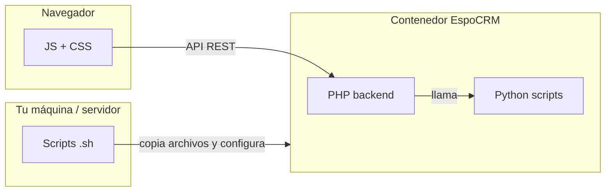

# Arquitectura del proyecto: PHP, JavaScript, Python y Shell

Guía de qué hace cada tecnología en el CRM de la Alcaldía (EspoCRM custom).



---

## PHP — el cerebro del servidor

Todo lo que **valida, guarda, notifica y genera documentos** en el servidor va en PHP. Vive en `espocrm-custom/` y en `scripts/*.php`.

### 1. Lógica que corre siempre (dentro de EspoCRM)

| Carpeta / tipo | Qué hace | Ejemplos en tu proyecto |
|----------------|----------|-------------------------|
| **Hooks/** | Se ejecutan **automáticamente** al crear, editar o borrar un registro | Al radicar un caso → notificar a Inspección; al asignar patrullero → cambiar estado a «En proceso»; al guardar acta → generar PDF |
| **Controllers/** | Endpoints API extra (`GET .../action/...`) | `Case/action/cronograma`, `Contact/action/expediente`, `ComunicacionCaso/action/agendaUsuario` |
| **Tools/** | Servicios reutilizables (lógica pesada) | Generar solicitud/acta/actuo, reporte gerencial, expediente del tercero, alertas de vencimiento |
| **Entities/** | Clases de entidades custom | `ComunicacionCaso`, `AsignacionHistorial` |
| **Classes/Select/** | Filtros y permisos en listas | «Contactos con casos asociados», quién ve qué reuniones/tareas |
| **EntryPoints/** | URLs directas (descargas) | Descargar reporte gerencial en PDF/Excel |

**Hooks importantes del flujo de casos:**

- `NotifyRadicacionOnCaseCreated` — avisa a radicación cuando hay caso nuevo
- `SetRadicadoOnPostRadicacion` — pone número de radicado y expediente
- `NotifyPatrulleroAssignment` — avisa al patrullero cuando Julian lo asigna
- `SetEnProcesoOnPatrulleroAssignment` — pasa el caso a «En proceso»
- `GenerateFormatoSolicitudOnSave` / `GenerateFormatoActaVisitaOnSave` — generan formatos oficiales
- `CaseAlertNotifier` + job de vencimiento — notificaciones de casos por vencer

### 2. Scripts PHP de configuración (`scripts/configure-*.php`)

No son parte del día a día del usuario. Los ejecuta **`deploy-custom.sh`** (o tú a mano) para **dejar la BD y los roles listos**:

- Permisos por rol (Inspección, Patrullero, Radicación…)
- Menú lateral, Kanban, calendario solo reuniones
- Permisos de `ComunicacionCaso`, `ActaVisita`, historial de asignaciones
- Valores por defecto al crear caso (recibido por, remitido a)

### 3. Scripts PHP de mantenimiento

| Script | Qué hace |
|--------|----------|
| `purge-crm-data.php` | Limpia datos de prueba |
| `backup-for-migration.sh` / `restore-from-migration.sh` | Respaldo y restauración |
| `configure-case-vencimiento-alerts.php` | Activa job de alertas; probar con `php command.php run-job CheckCaseVencimientoAlerts` |

**Resumen PHP:** reglas de negocio, seguridad, notificaciones, generación de archivos y configuración del sistema.

---

## JavaScript — lo que ve y hace el usuario en el navegador

Vive en `espocrm-custom/files/client/custom/`. EspoCRM carga estos archivos cuando alguien abre el CRM.

| Carpeta / tipo | Qué hace | Ejemplos |
|----------------|----------|----------|
| **views/** | Pantallas y comportamiento de formularios | Inicio con pestañas (Dashboard, Agenda, Comunicaciones), panel de comunicaciones del caso, expediente del tercero |
| **helpers/** | Lógica compartida entre vistas | Modal de comunicación, radicado automático, validación solo números, cronograma |
| **loader/** | Arranque global (tema, traducciones) | Navbar verde, textos «Peticionario/Infractor» |
| **dashboard.js** + **dashboard.html** | Tablero de gráficas del Inicio | Casos por barrio, embudo, radicados por día |
| **res/css/** | Estilos visuales | Paneles, navbar, cronograma, ancho completo |
| **res/templates/** | HTML de paneles custom | Expediente tercero, comunicaciones caso |

**Ejemplos concretos de lo que hicimos:**

- `home.js` — pestaña Agenda con reuniones, tareas y comunicaciones del usuario
- `numeric-only.js` — cédula/NIT/teléfono solo números + mensaje de error
- `notification/badge.js` — contador de campana solo con notificaciones nuevas
- `comunicaciones-caso.js` — lista y registro de comunicaciones en el detalle del caso

**Resumen JS:** interfaz, validaciones en pantalla, tablero, enlaces y experiencia del usuario. **No guarda en base de datos solo**; pide al PHP vía API.

---

## Python — documentos y Excel

EspoCRM **no genera bien** Word/PDF/Excel complejos solo con PHP. Por eso hay scripts Python en `espocrm-custom/files/scripts/` (y algunos en `scripts/`).

| Script | Qué hace |
|--------|----------|
| `fill-formato-solicitud.py` | Rellena la plantilla de **solicitud** (Word/PDF) con datos del caso |
| `fill-formato-acta-visita.py` | Rellena **acta de visita** |
| `fill-formato-actuo-archivo.py` | Rellena **acto de archivo** |
| `pdf-overlay-utils.py` | Superpone texto en PDF (marcas/casillas del formato) |
| `upsert-excel-alcaldia.py` | Sincroniza filas con el **Excel oficial** de la Alcaldía (`excelAlcaldia.xlsx`) |
| `generate-reporte-gerencial.py` | Arma el HTML/PDF del **reporte gerencial** |

**Flujo típico:** el usuario guarda un caso o acta → un **Hook PHP** (`GenerateFormato...OnSave`) arma un JSON con los datos → **llama a Python** → Python escribe el `.docx`/`.pdf`/`.xlsx` → PHP lo adjunta al caso como Documento.

**Resumen Python:** rellenar plantillas oficiales y mantener el Excel institucional. Corre **dentro del contenedor Docker**, no en el navegador.

---

## Shell (.sh) — operación y despliegue

Scripts Bash en `scripts/`. Son **automatización para ti y para el servidor**, no para el usuario final del CRM.

| Script | Qué hace |
|--------|----------|
| **`deploy-custom.sh`** | El más importante: copia PHP + JS al Docker, rebuild, clear cache, ejecuta todos los `configure-*.php`, plantillas en `formatos/` |
| `setup-mac.sh` | Arranque en Mac: Docker + restore dump + deploy |
| `backup-for-migration.sh` / `restore-from-migration.sh` | Backup y restore de BD + archivos |
| `purge-crm-data.sh` | Wrapper para limpiar datos |
| `fix-custom-permissions.sh` | Arreglar permisos de archivos en el contenedor |

**Resumen .sh:** después de cambiar código, casi siempre corres:

```bash
bash scripts/deploy-custom.sh
```

y recargas el navegador con **Cmd+Shift+R**.

---

## Cómo encaja todo en un ejemplo real

### «Juan registra una comunicación en un caso»

1. **JS** — abre el modal, valida campos, envía `POST` a la API
2. **PHP** — `ComunicacionCaso` se guarda; hook `FillFromCase` copia radicado del caso
3. **JS** — el panel del caso y la Agenda vuelven a pedir la lista (`GET` API)
4. Si hubiera notificación para otro rol → **PHP** crea fila en `notification` → **JS** de la campana muestra el contador

### «Patrullero guarda el acta de visita»

1. **JS** — formulario del acta
2. **PHP** — hooks validan, cambian estado del caso, notifican a Juan/Julian
3. **PHP → Python** — genera Word/PDF/Excel del acta
4. **PHP** — adjunta documentos al caso

---

## Regla práctica

| Si quieres cambiar… | Toca principalmente… |
|---------------------|----------------------|
| Qué ve el usuario, botones, tablas, mensajes en pantalla | **JS** (+ CSS) |
| Reglas al guardar, permisos, notificaciones, API | **PHP** (Hooks, Tools, Controllers) |
| Campos nuevos, layouts, traducciones | **JSON** en `Resources/metadata/` + deploy |
| Formatos Word/PDF/Excel oficiales | **Python** + plantillas en `formatos/` |
| Publicar cambios al Docker | **`deploy-custom.sh`** |

---

## Documentos relacionados

- [ESTADO-CUMPLIMIENTO-OBJETIVOS.md](./ESTADO-CUMPLIMIENTO-OBJETIVOS.md) — avance por objetivo del proyecto
